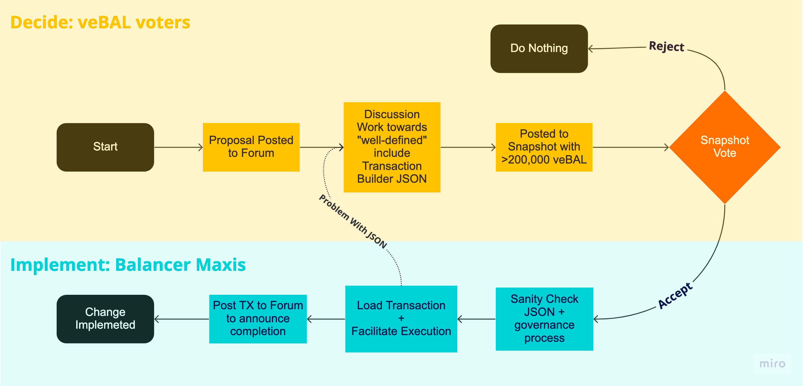

# Governance Process

## Summary

The Balancer Govenrance process has evolved through a number of BIPs as balancer moves along on it's quest towards decentraliztion.  The most recent governance overhaul BIP at the time of this writing is [BIP-163](https://snapshot.org/#/balancer.eth/proposal/0xcd2cab0522b0e9a90ad40f93aca4505b17d60468224c22b69c4f9bd2bbd64e31).

Balancer governance submissions consist of 2 items, an english proposal and a multisig payload that executes the changes described onchain.  The Balancer Maxis, who can be found on the [Balancer Discord](https://discord.balancer.fi/) or contacted through an issue in the [Balancer Multisig Ops Repo](https://github.com/BalancerMaxis/multisig-ops/issues) are tasked with supporting community members in putting together proposals when required, and with the final evaluation and execution of approved proposals.  Below are more details on the governance process as of BIP-163.

## Outline
This page outlines the Balancer Governance Process from Request for Comment \[RFC\] through executing a result. 

1. Post a Request for Comment to the forum
2. Facilitate preliminary discussion
3. Update and refine RFC to become a Proposal
4. Snapshot vote
5. Execute result or try again in 30 days
### Step 1: Write Request For Comment \(RFC\)

An initial request for governance is made up of 2 potential components.  An English language description of the purpose of the proposal and the details of the changes to be made, and a payload to execute such changes on chain which can be loaded into gnosis-safe if on-chain changes are required for execution.  When possible, any off-chain changes to code should also have PRs linked in governance.

#### **English Description**
Start a new conversation:  [General Proposals](https://forum.balancer.fi/c/governance/7) or [veBAL Gauge additions](https://forum.balancer.fi/c/vebal/13) with the [RFC] tag. The message should contain the following sections.
* **Link to Transaction Payload PR**
  * _The Snapshot body should begin with a link to the transaction payload PR on github. If the text is too long it can be truncated.Note that if the proposal requires no on-chain actions to be executed, the payload is not required._
  * _Note that this link can be added towards the end of the discussion process once the proposal is moving to snapshot._ 
* **Background and motivation**
  * _What is the current state or what you're addressing?_  
  * _What is the reason for this?_
  * _Why is it good for the veBAL ecosystem or the Balancer Protocol?_  
  * _Is there any relevant information that the common reader might not know?_
* **English Specification**
  * _Clearly state exactly what this proposal will change and the effects it will have on the operation of the protocol or balance of the treasury._
* **Dependencies(if any)**
  * _What is needed to introduce the change?_
* **Risk assessment**
  * _What can go wrong? What is the impact of your proposal on the rest of the community, ecosystem, protocol?
    * _For Spend (how does it affect runway)_
    * _For Gauge Votes (consider pool makeup and caps as per the Gauge Framework defined in BIP- and/or community discussion)_
For other changes explain any and all risks clearly._
* **Open Questions**
  * _Any obvious discussions or things you are still considering?_

Further, votes requesting new gauges should include the following information:
* What are the initial fees set to, and what is the reasoning for this?
* If stableswap, how is the A-factor set and why was the given a-factor chosen?
* If custom pool, how does this pool generate revenue? Is 50% of the revenue generated sent to the fees collector? Where can details about the performance of this pool be found? Where can users deposit into it and swap through it?

### **Step 2: Discussion**

* Encourage and participate in discussions on the forum.
* Promote your topics, find voters, get feedback.
  * Consider contacting [Delegates](https://forum.balancer.fi/c/delegate-citadel/14) to obtain their support.
* Encourage interested parties on Discord to gather their thoughts in a forum post
* It is advised that proper time is given for the community to discuss a proposal before bringing it to snapshot and that that the Original Poster is open to making changes as part of the discussion process.
* The Maxis will perform initial validation on any submitted snapshots and get in touch with the OP if there are issues, inviting them to take down their vote and repost it properly to avoid an end result that can not be executed due to lack of compliance. 

### **Step 3: Develop and validate transaction Pull Request**
**NOTE:** The Balancer Maxis are also available to build and validate your PR.  If you don't want to get involved in the techincal details of defining your execution, contact the Balancer Maxis and they will be happy to help.  They can be found in the [Balancer Discord](https://discord.balancer.fi) and are listed in the [HERE](https://docs.balancer.fi/concepts/governance/multisig.html#dao-multisig-signer-set)

A Pull Request(PR) that posts a transaction to a gnosis safe mutlsig which executes the changes specified by the BIP on-chain is required as part of the body of a Proposal specified above before it can be brought to valid snapshot.  

The file(s) should be added into their own directory [HERE on the Multisig Ops Repo](https://github.com/BalancerMaxis/multisig-ops/tree/main/BIPs/00proposed). Once the BIP is to snapshot and a BIP number is selected, the files will be moved into the [BIPs directory](https://github.com/BalancerMaxis/multisig-ops/tree/main/BIPs) following the apparent pattern there. The description of the pull request should contain a link to the Forum Post with the English Specification of it.  The Balancer Maxis will review the payload and post any concerns or questions in review.

Examples of how to submit payload PRs for common governance quests can be found [HERE](https://github.com/BalancerMaxis/multisig-ops/tree/main/BIPs/00examples)

### **Step 3: Snapshot**

The snapshot process is started when an address with at least 200,000 veBAL in delegation posts a snapshot to the forum that meets all of the required specifications as defined in [BIP-163](https://forum.balancer.fi/t/bip-163-restructure-governance-process-disband-governance-council/4244).

* The Snapshot body should begin with a link to any required transaction payload PR on github. Followed by the full text of the BIP. If the text is too long, it can be truncated.
* A link to the forum discussion should be included in the discussion (optional) field of Snapshot.
* The BIP is titled like `BIP-[XXX] Title from Forum`, where XXX is the next number in the BIP sequence.
  * The Original Forum Poster should update their post to match the title from the snapshot and include a link to it at the bottom of the body of the Forum Post.
* Barring clear community consensus otherwise the vote Should be of Type “Basic Voting” and the choices should be one of [Yes, let’s do it - No, This is not the way - Abstain].
* Runs for 96 hours starting on a **Thursday (GMT)**.
* Has a quorum of 2 million veBAL.
* The linked payload matches the english specification and fails review and is in a recognizable/verifible form by the Maxis.
* The linked payload simulates successfully in tenderly and/or produce the desired results on fork.

**IMPORTANT:** A snapshot that does not meet all of the above requirements will not be valid even if it wins a majority of the votes.  Please take your time when posting snapshots.  A number of the Balancer Maxis have delegations of over 200k veBAL and would be happy to help you post your snapshot if you are unsure and it has some community support.

If a snapshot is approved by governance but rejected for technical reasons, the Maxis will help to fix the payload and facilitate a revote to approve. 

### Step 4: Results and Execution

If the vote fails in an approve/reject vote it will not be executed on.  Proposes are encouraged to wait at least 30 days and/or until something significant has changed before posting another vote, and delegates with sufficient veBAL to post votes are asked to be considerate about creating governance noise and SPAM by reposting failed votes in rapid succession.

If the vote succeeds or a result has been chosen, follow through to make sure that it is properly executed. Depending on what the vote is about, it may require an action by the [Multisig](./multisig.md).  The Balancer Maxis are responsible for organizing the onchain execution of governance.  They're working toward making their process as transparent as possible in the public [Balancer Multisig Ops Github Repo](https://github.com/BalancerMaxis/multisig-ops)

Assuming all reviews are finished and dependancies are met, the Maxis will make every effort to execute on finished in the same week that governance concludes. Note that it some cases complex BIPs may require more time for final multisigner review.

The Maxis will endeavor to post a comment to the Forum post with a link to the execution TX upon execution.

