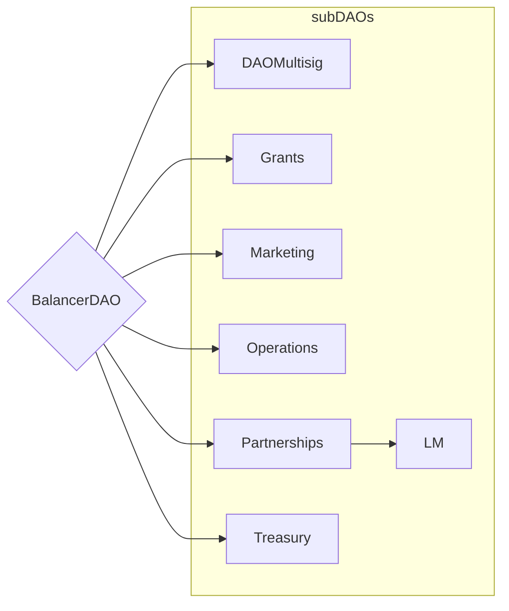

# Components

## Terminology

Balancer is an umbrella term that represents a diverse ecosystem of independent components, tools, and contributors.

**Balancer Protocol** is the set of smart contracts that lives on the blockchain and facilitates all of the interactions of swapping, liquidity provisioning, pool creation, and more.

**Balancer Dapp** is an open source frontend application that users can use to easily interact with the underlying smart contracts.

## Ecosystem Participants

**Balancer Labs** is the original entity that developed the protocol and now focuses entirely on open source smart contract development.

**Orb Collective** is an independent entity created by a team of former Balancer Labs and Balancer DAO contributors. Orb is an experienced and passionate team of professionals who are dedicated to propelling Balancer’s growth. Orb Collective’s mission is simple: to scale global utilization of the Balancer Protocol.

**Balancer Foundation** provides the DAO with an additional mechanism for executing work, furthering Balancer’s decentralization goals, and building resilience across the Balancer Ecosystem.

**Balancer OpCo** a wholly-owned subsidiary of the Balancer Foundation. It is an integral element of the Balancer Foundation corporate structure supporting the BalancerDAO, and is intended to serve two primary functions: Administrative & Operational and Frontend Dev & Engineering Workstream.

**Balancer DAO** is the decentralized autonomous organization which encompasses the Balancer community. An architecture of Sub-DAOs has been voted into practice by a governance vote. The major actors in the community may be appointed or removed from any positions they hold in the sub-DAOs.

